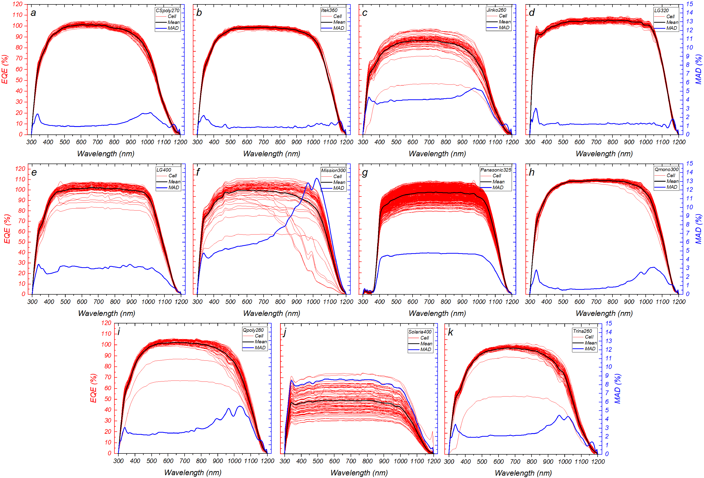
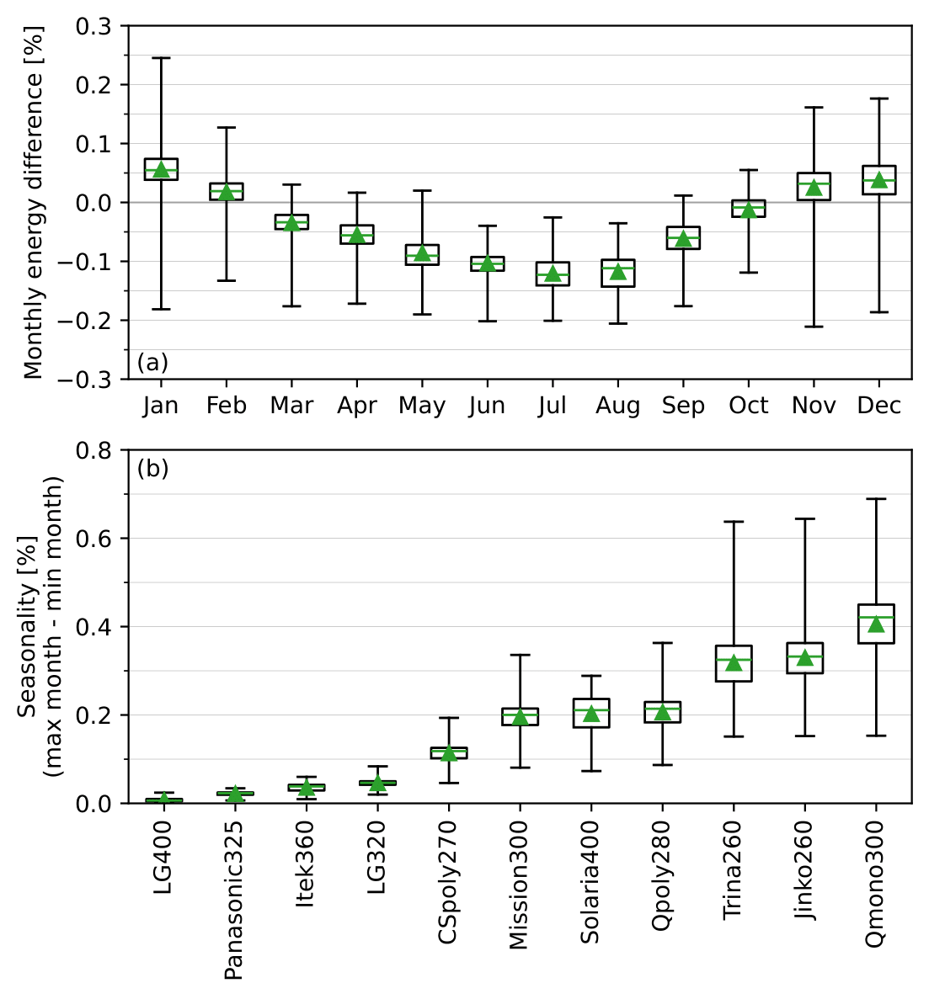

.. map-header::

Impact of cell-to-cell EQE variation on power output
====================================================

*Content contributed by National Renewable Energy Laboratory*

Introduction
------------

Cells in a PV module are typically connected in series, hence module
performance is limited by the cell generating the lowest current.  Reduced cell
performance can arise from manufacturing inconsistencies between cells, or
in-operando events such as localised temperature hotspots and non-uniform
module degradation.

Previous studies have investigated how external envrionmental factors
such as non-uniform shading can lead to reduced individual cell or module
performance, resulting in mismatch losses.  While manufacturing inconsistencies
between cells are often cited as a cause of intramodule mismatch losses, they
are typically overlooked in the existing body of research.

One way to study the inherent differences between cells is through analyzing
their external quantum efficiency (EQE).  A cell's EQE curve represents the
efficiency with which incident photons of different wavelengths generate a
photocurrent.  Although this spectral effect on PV performance has been studied
at the module level, no studies have analysed the spectral effect at the cell
level and its potential role as a driver of mismatch losses at the module
level.  

To investigate the role of cell-to-cell variation on module performance, the
following questions are posed:

#. How does the EQE vary between cells?
#. What is the impact on PV performance?
#. Does the performance impact vary seasonally or geographically?

Methodology
-----------

EQE curves for each cell within each of 11 PV modules were measured by the Cell
Measurement and Performance group at the National Renewable Energy Laboratory.
These data are analysed in conjunction with one year of simulated 30-minute
meteorological data, including spectral irradiance, spanning the contiguous
United States at a resolution of around 0.2° longitude/latitude (around 20km).
At this resolution, the dataset covers around 21,000 individual locations.

The PV devices studied cover a range of technologies, including monocrystalline
silicon (monoSi) and polycrystalline silicon (polySi), and a range of cell
architectures including Al-BSF (Aluminium Back Surface Field), IBC
(Interdigitated Back Contact), PERC (Passivated Emitter and Rear Contact), PERT
(Passivated Emitter Rear Totally Diffused), and SHJ (Silicon heterojunction).

To quantify the impact of intramodule EQE variation on PV device performance,
the output from the worst cell (lowest performance) is compared with that of
a hypothetical average cell, determined from the mean cell EQE.

The mean EQE curve is a useful approximation of the module EQE that a modeler
may use to estimate module performance without the need to process multiple EQE
curves and individual cell performances to determine which is driving the
module performance under any given spectral irradiance condition.  The power
loss calculation thus provides an indication of the error incurred through this
approximation.

Results
-------

How does the EQE vary between cells?
~~~~~~~~~~~~~~~~~~~~~~~~~~~~~~~~~~~~
There are four forms of EQE variation among the devices, classified by this
study as follows:

#. Negligible
#. Amplitude
#. Wavelength
#. Mixed

The first type of variation is characterized by a tight distribution with a
mean absolute deviation of between 1% and 3% that is largely independent of
wavelength.  Examples include the CSPoly270 and Itek360 modules. The EQE
variation for the Panasonic325 module is also independent of wavelength, but a
significantly greater amplitude-dominant variation is present with a
relatively stable MAD of around 5%.  This relatively uniform variation in EQE
can be caused by a mixture of internal factors such as parasitic losses, and
external factors such as reflection leading to variable illumination from cell
to cell for each measurement.  The third category is characterized
predominantly by wavelength-dependent variation, such as in the case of the
Qpoly280 device. Finally, devices such as the Mission300 module exhibit a
mixture of wavelength-dependent and amplitude variation, thus falling into the
fourth category.  The cell-level EQE curves for all 11 modules are shown in
Figure 1.

    Figure 1. Cell EQE, median EQE, and MAD for the PV devices.
    (a) CSpoly270. (b) Itek360. (c) Jinko260. (d) LG320. (e) LG400.
    (f) Mission300. (g) Panasonic325. (h) Qmono300. (i) Qpoly280.
    (j) Solaria400. (k) Trina260.

What is the impact on PV performance?
~~~~~~~~~~~~~~~~~~~~~~~~~~~~~~~~~~~~~
Figure 2 shows the annual energy difference between the potential
non-mismatched output, as determined by the mean EQE, and the realistic module
output, as determined by the limiting cell. The data presented are for the Mission300
module, as an example. The overall energy difference, ΔE, is relatively low for all
modules, rarely exceeding ±0.20%.  Nonetheless, there is a link between the scale of
loss and the type of EQE variation.  Modules with greatest ΔE are also those whose
intramodule EQE variation is characterized by a wavelength dependence (category 3)
or mixed variation (category 4). Variation in amplitude is likely to result primarily
from systematic measurement error, for example due to variable cell illumination,
and its effect is removed through an inherent normalization in the calculation
of M.

    The monthly energy difference for the Mission300 module.  The Mission300 exhibits
    category 4 (mixed) cell-to-cell EQE variation, resulting in one of the largest
    energy differences both on a monthly and annual scale.

Does the performance impact vary seasonally or geographically?
~~~~~~~~~~~~~~~~~~~~~~~~~~~~~~~~~~~~~~~~~~~~~~~~~~~~~~~~~~~~~~
Could the low annual ΔE be a result of month-to-month variations cancelling
each other out? The monthly breakdown of ΔE values shown in Figure 2 for the Mission300
module provide some insight into this.  The range in each month represents the range of
ΔE across the contiguous USA while the triangle and horizontal bar represent
the mean and median ΔE, respectively.  On a monthly scale, the energy
difference is more significant than on an annual basis.  The range from month to month
is almost double the annual energy difference, with an approximately 50:50 split between
positive and negative ΔE months.

Figure 3 presents the remaining results in a different form, for all modules.  The
boxplots in Figure 3 illustrate the seasonality in ΔE, calculated for the whole year as
the difference between the maximum ΔE month and the minimum ΔE month.

Since ΔE can be positive or negative, besides reducing the annualized ΔE, this
phenomenon also indicates that the driving cell under the prevailing spectrum
can yield both an energy gain or loss with respect to performance driven by
the mean EQE cell in the absence of intramodule EQE variation.

    Figure 3. Seasonality breakdown for all 11 modules. The seasonality boxplots show
    the energy difference between the minimum and maximum ΔE months, for each location,
    for all 11 modules.  In all plots, the horizontal bar represents the median, while
    the triangle represents the mean.

In terms of geography, ΔE has a range of 0.46% across all locations, which is
over four times the annualized ΔE.  Another phenomenon related to location is
the fact that the annual ΔE values are notably larger in the south/south east
USA than in the western states. This effect is particularly significant in
coastal states such as Florida, where the subtropical climate is driven by
high levels of humidity that are known to increase the spectral influence on
PV performance (Marion et al., 2014).

Figure 4 presents the energy difference data, across the contiguous US, for a
sample of four of the 11 modules, which each represent one of the four
identified categories of cell-level EQE variation.  These are the Itek360
(negligible) module, Panasonic325 (amplitude) module, Qpoly280 (wavelength)
module, and the Mission300 (mixed) module.  Data for all 11 modules can be
found at the end of this webpage.

.. map-widget:: 
   :colorscale_min: -1
   :colorscale_max: +1
   :colorscale_name: RdBu
   :short_description: ΔE [%]
   :layers_title: Module:

    cell-level-smm/Itek360_annual_US_2022.tiff : Itek360
    cell-level-smm/Panasonic325_annual_US_2022.tiff : Panasonic325
    cell-level-smm/Qpoly280_annual_US_2022.tiff : Qpoly280
    cell-level-smm/Mission300_annual_US_2022.tiff : Mission300

    Figure 4. Annual energy difference, ΔE , comparing P2 (mean EQE) and
    P1 (limiting EQE) over the course of the year for four sample modules
    across the contiguous USA. Across all locations, the annualized ΔE is
    typically no greater than ± 0.2%. Of all 11 modules, five modules
    experience an annual energy loss, two experience an annual energy gain,
    and four exhibit no significant annualized performance variation due to
    cell-level EQE variation.

Discussion
----------

While the absolute annual ΔE is restricted to only around 0.1%–0.2%, on a
monthly basis the uncertainty due to cell-level EQE variation increases to
almost 1%.  This increase in error has implications for subannual PV
performance assessment applications such as capacity testing, which can last
only a few days/weeks at any given time over the course of the year.

Since the modules analyzed are new, one aspect to consider in future work is
how these results may evolve over time.  A direct correlation between
wavelength-dependent cell-level EQE variation and increased energy losses is
observed.  PV module degradation is typically nonuniform across a module's
constituent cells, and different degradation modes can impact different
wavelength regimes of the device EQE (Wang et al., 2020, Marion et al., 2014).  
Therefore, future studies should consider how nonuniform degradation and
different degradation mechanisms may influence intramodule EQE variation and
thus the energy losses reported in this work.

Conclusion
----------

Cell-level EQE data have been ananlysed to determine the scale and nature of
intramodule EQE variation and the any associated mismatch power losses.  
Overall, four categories of EQE variation have been identified: negligible
variation, amplitude variation, wavelength-dependent variation, and mixed
variation.  Amplitude variation is likely a result of systematic measurement
error, but wavelength-dependent variation (shape fo the EQE curve) alters the
spectral mismatch factor and, thus, determines the driving cell within the
module.  On an annual timescale, comparing each module to its respective
hypothetical counterpart that does not exhibit cell-level EQE variation, the
difference in energy output is below approximately ±0.2%.  However, these
energy losses suffered seasonal and geographical variation whereby on a
month-to-month basis the energy difference can change by over four times the
annualized difference, representing a range of almost 1%.  The seasonality
of these results has implications for subannual PV performance applications
such as capacity testing.  In future work, it will be important to consider
how these results may evolve over time when the modules exposed outdoors.  It
is possible that nonuniform degradation over a module's lifetime may
exacerbate the energy losses reported in this work.

The full study may be found in Reference Daxini et al. (2025)

References
----------

.. bibliography::
   :list: enumerated
   :filter: False 
   
   marion2014analysis
   wang2020influence
   Daxini2025photovoltaic

Data files
----------
The geographic datasets shown on this page are available in the GeoTIFF
files listed below:

.. geotiff-index::
    :pattern: geotiffs/cell-level-smm/*.tiff